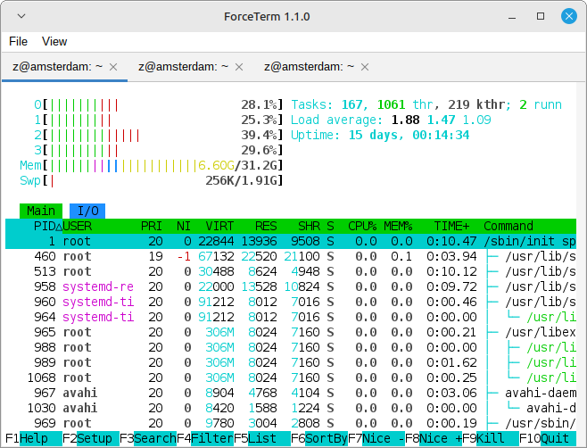
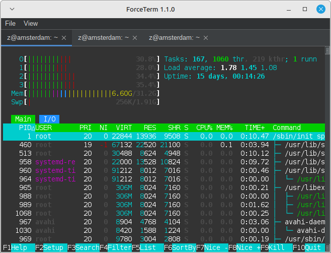

# ForceTerm

The Terminal Strikes Back.

Fully featured terminal based on [jediterm](https://github.com/JetBrains/jediterm).

## Usage

### Download an run a binary

Head over to the [releases](https://github.com/sebkur/forceterm/releases/)
section. We provide MSI installers for Windows, zipped appliation bundles
for macOS and AppImage self-contained executables for Linux.

### Run from source

There are two ways to run the application from source.

Variant 1 (Linux and macOS only):

    ./gradlew clean create
    ./scripts/forceterm

Variant 2 (cross-platform):

    ./gradlew pinpitRun

## Hacking

To work on this project you'll probably want to load it into an IDE.
You should be able to load it into IntelliJ IDEA or Android Studio
directly.

In order to import the project into an Eclipse workspace, first
create the Eclipse project and classpath files:

    ./gradlew cleanEclipse eclipse

In any IDE, locate the class `RunForceTerm`, which has the main
method, and launch it.

## Release documentation

Create a tag and push it to origin:

    git tag -a release-<version> -m "Release <version>"
    git push origin release-<version>

Build release binaries:

    ./release.sh
